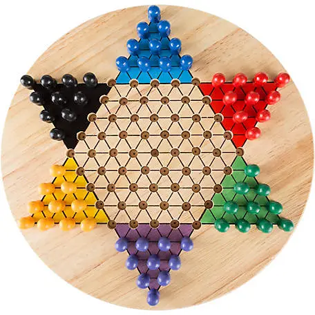

# stern-halma-plus
AI Player of Sternhalma Plus (2 players, 15 marbles for each)

🎈 What is Sternhalma?

Sternhalma, commonly known as Chinese checkers or Chinese chequers, is a strategy board game of German origin that can be played by two, three, four, or six people, playing individually or with partners. The game is a modern and simplified variation of the game Halma.



<br>

🎈 What is Sternhalma Plus?

Sternhalma Plus is a modified version of Sternhalma, with 2 players and 15 marbles per each player. Sternhalma Plus is only for 2 players, but more interesting and strategical than original version.


<br>

🔍 Why Sternhalma Plus?

Stern-halma is a very simple game that can be completely solved. However, simply placing one more marble row significantly increases the complexity of the problem and makes it difficult to find a winning strategy. Therefore, Sternhalma Plus is by no means a game for kids to just enjoy. Please try it, you will feel a totally different game. And you'll love it!

<br>

🎯 The Solution

Deep Mind's AlphaGo has achieved remarkable success in board game, but they are by no means the solution to all problems.
Chinese checker is a typical example of that. Unlike Go, this board game may be endless, and the actions are non-regularized and massive. (361 in case of Go)
For this reason, no meaningful research results have been produced for Chinese checker.

To find the best solution, we tried various options of well-known Reinforcement Learning approaches: DQL, A3C, PPO, ...
Finally we developed an alterated version of AlphaGo Zero to overcome this problem.

Here we splitted Policy network into twon parts. The critical code snippets are in model.py like the following:

## Splitation of Policy Network

```
self.spi_head_conv = Conv(conv_channels, head_channels, 1, True)
self.spi_hidden_fc = Dense(head_features, hidden_features, True)
self.spi_fc = Dense(hidden_features, mini_board_size, False)

self.epi_head_conv = Conv(conv_channels, head_channels, 1, True)
self.epi_hidden_fc = Dense(head_features, hidden_features, True)
self.epi_fc = Dense(hidden_features, mini_board_size, False)
```

## Smart Combination for Inference/Back-propagation

```
spi = self.spi_head_conv(out)
spi = self.spi_hidden_fc(spi.flatten(1))
spi = self.spi_fc(spi)
spi = F.log_softmax(spi, dim = -1)

epi = self.epi_head_conv(out)
epi = self.epi_hidden_fc(epi.flatten(1))
epi = self.epi_fc(epi)
epi = F.log_softmax(epi, dim = -1)

spi = spi.reshape((len_x, mini_board_size, 1)).expand((-1, -1, mini_board_size))
epi = epi.reshape((len_x, 1, mini_board_size)).expand((-1, mini_board_size, -1))
```

💬 How to use this source?

   ✅ run selfplay.py to collect play data

   ✅ run train.py to train from selfplay dataset

   ✅ run test.py to test best model

   ✅ run server.py to start Flask server
